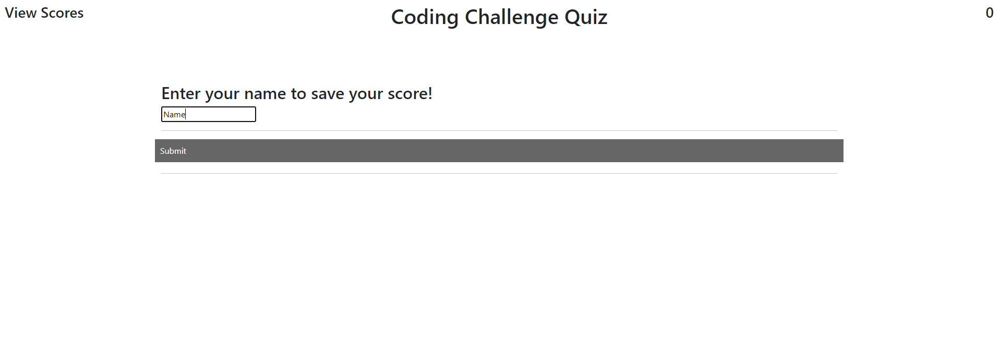

# Coding Quiz

Application: https://tjvig94.github.io/coding-quiz/
Repo: https://github.com/tjvig94/coding-quiz

<h2>Overview</h2>

This is a single-page application in which a user clicks a button that initiates a
quiz game. In this game, the user is presented with a series of quesitons that must 
be answered as a timer ticks down. 

 - If a user clicks on the correct answer, they see a message
 affirming their correct answer choice and then are shown the next question. 

 - If the user selects an incorrect answer, they are alerted they chose a wrong answer, 
15 seconds is deducted from the time, and they are shown the next question.

 - When either the time has expired or they have answered the final question, the user
enters their name. The name and remaining time are saved as the username and score.

 - After the user has entered their name, they are shown a series of scores and names.

<h2>User Experience and Design</h2>

 - Bootstrap was used for basic structure and styling.

 - The page is designed to be as light and clean as possible. The user is presented with an obvious "START" button, with
 little else on the page, thus directing their attention directly to the purpose of the page.

  - Users receive feedback during their experience as the answer options for the questions change color when they are hovered over,
  and the cursor changes to a pointer, letting the user know that something will happen if they click on it.

 - Users can go directly to the score page by clicking "View Scores" in the corner. They know they can click it because the color of
 the text and the type of cursor both change.  

<h2>JS, jQuery, and JSON</h2>

 - In order to provide the simplest user experience, this quiz was created as a single-page application.
This is achieved by using jQuery to listen for clicks on particular buttons or text areas, and to hide/show particular divs
and buttons.

 - So that users could save their names and scores, each name and score at the end of a game is stored as an object and pushed
into an array of other saved names/scores. In order for users to see those scores, the array of those objects are looped over
in appended list items for as many score objects as there are in the array.

 - The set of questions is an array of objects. Each object has a question, four answer options and a correct answer.
The quiz area is filled with the contents of the object at the current index in the array. The data-set attribute in the HTML is
compared against the correctanswer field in the current object to check to see if the clicked area matches the correct answer.

<h2>Screenshots</h2>

